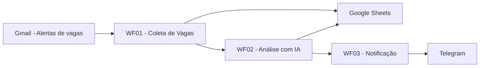
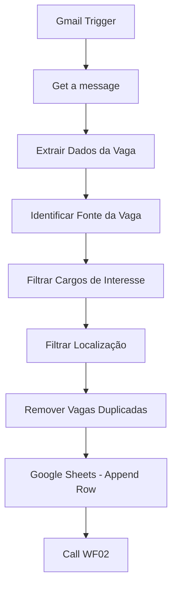
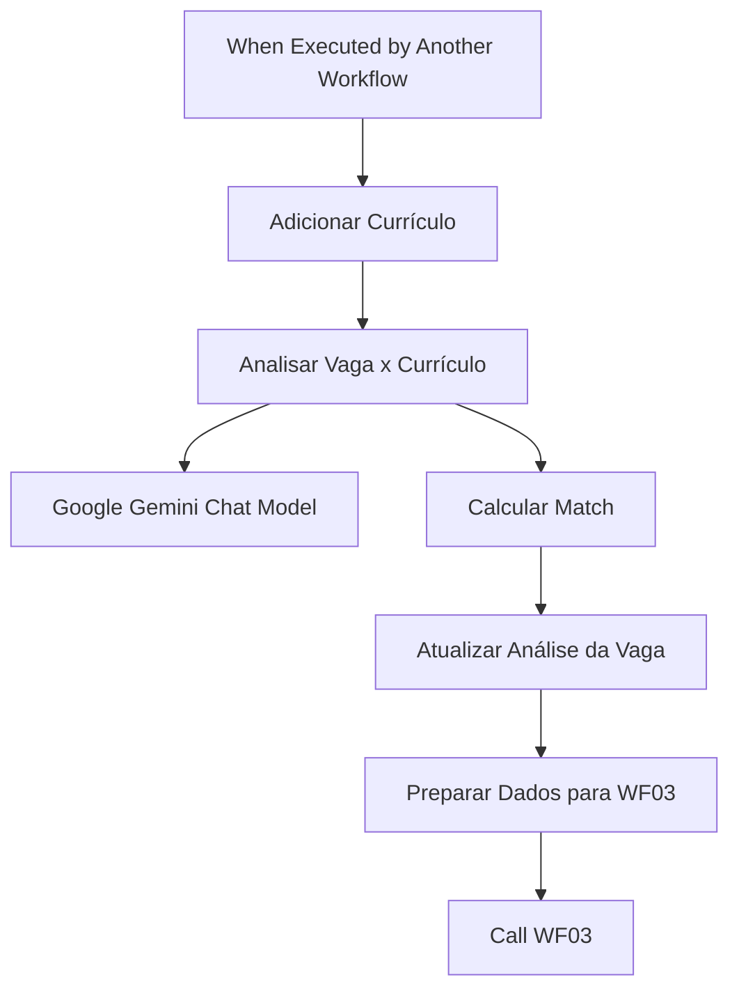
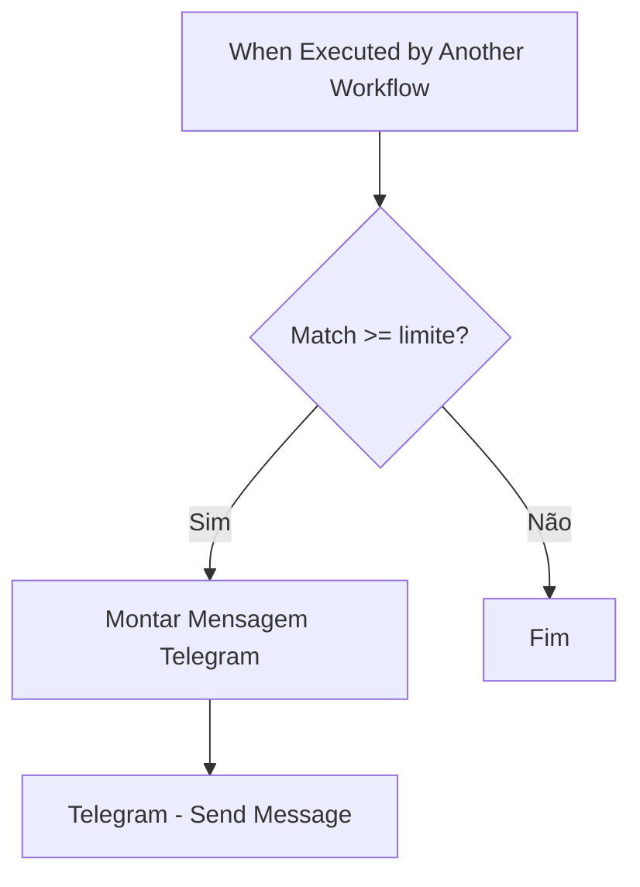

# Automação Inteligente de Vagas com n8n, IA e Telegram

Projeto de automação para coletar alertas de vagas recebidos por e-mail, filtrar oportunidades de interesse, comparar os requisitos da vaga com o currículo do candidato usando Inteligência Artificial, calcular uma estimativa de compatibilidade e enviar notificações de vagas com alto match pelo Telegram.

> **Objetivo:** reduzir o trabalho manual de pesquisar, abrir e comparar vagas, mantendo a decisão final de candidatura com o candidato.

---

## Visão geral

A solução foi dividida em três workflows independentes no n8n:

- **WF01 - Coleta de Vagas**
- **WF02 - Análise e Match com Currículo**
- **WF03 - Notificação de Vagas**

Essa separação deixa a automação mais modular, fácil de testar e simples de evoluir.

### Arquitetura



---

# WF01 - Coleta de Vagas

Responsável por ler e-mails de vagas, extrair os dados principais, aplicar filtros e registrar novas oportunidades.

## Fluxo



## Gmail

Foi criado no Gmail um marcador:

```text
Vagas Emprego
```

O Gmail aplica esse marcador aos alertas de vagas e o `Gmail Trigger` do n8n monitora somente mensagens com esse marcador.

### Fontes previstas

- Indeed
- LinkedIn
- Gupy

A estrutura está preparada para múltiplas fontes. O parser do Indeed foi validado com e-mails reais. LinkedIn e Gupy podem exigir pequenos ajustes conforme o formato dos alertas recebidos.

## Extração dos dados

O node `Extrair Dados da Vaga` transforma o e-mail em um objeto padronizado.

Exemplo:

```json
{
  "id_email": "ID_DO_EMAIL",
  "fonte": "Indeed",
  "cargo": "Product Owner",
  "empresa": "Empresa Exemplo",
  "localizacao": "Não informado",
  "modelo_trabalho": "Remoto",
  "tipo_contrato": "Não informado",
  "salario": "Não informado",
  "descricao": "Descrição da vaga...",
  "link": "https://...",
  "status": "NOVA"
}
```

Campos ausentes não são inventados. Quando a informação não está disponível no alerta, o fluxo utiliza:

```text
Não informado
```

## Filtro de cargos

Os cargos são filtrados por expressão regular.

Exemplos:

```text
Analista de Requisitos
Analista de Negócios
Analista Funcional
Analista de Implantação
Analista de Sistemas
Analista de Processos
Analista de Automação
Business Analyst
Requirements Analyst
Functional Analyst
Implementation Analyst
Automation Analyst
Product Owner
Product Manager
n8n
```

O filtro é case-insensitive porque o valor é normalizado com `toLowerCase()`.

## Filtro de modelo de trabalho

O fluxo pode aceitar:

```text
remoto
OU
não informado
```

Isso evita descartar automaticamente uma vaga apenas porque o e-mail não trouxe o modelo de trabalho.

## Remoção de duplicados

O node `Remove Duplicates` usa:

```text
id_email
```

como chave para impedir que o mesmo alerta seja processado novamente.

---

# WF02 - Análise e Match com Currículo

Responsável por comparar a vaga com o currículo usando IA e calcular o match de forma determinística.

## Fluxo



## Currículo

O currículo é disponibilizado ao workflow em um campo chamado:

```text
curriculo
```

Para um repositório público, **não publique telefone, e-mail, endereço, documentos ou o currículo completo dentro do workflow exportado**.

Use um currículo anonimizado ou substitua o conteúdo por:

```text
[CURRICULO_DO_CANDIDATO]
```

## Análise com IA

O Gemini recebe:

- cargo;
- empresa;
- localização;
- modelo de trabalho;
- tipo de contrato;
- descrição da vaga;
- currículo.

A IA é instruída a:

- não inventar experiências;
- não inventar competências;
- não assumir tecnologias não citadas;
- analisar somente vaga e currículo;
- identificar requisitos;
- classificar o atendimento de cada requisito;
- apresentar evidências;
- apontar pontos fortes e lacunas;
- não calcular o percentual de match.

### Status possíveis

```text
ATENDIDO
PARCIALMENTE_ATENDIDO
NAO_ENCONTRADO
```

### Tipo de requisito

```text
OBRIGATORIO
DESEJAVEL
NAO_INFORMADO
```

Exemplo de resposta:

```json
{
  "requisitos": [
    {
      "requisito": "Experiência com análise de requisitos",
      "tipo": "NAO_INFORMADO",
      "status": "ATENDIDO",
      "evidencia_curriculo": "Experiência profissional em análise e detalhamento de requisitos."
    }
  ],
  "pontos_fortes": [
    "Experiência em análise de requisitos"
  ],
  "lacunas": [],
  "justificativa_resumida": "O currículo possui evidências compatíveis com os requisitos principais."
}
```

---

# Cálculo do Match

A porcentagem não é definida pelo modelo de IA.

Ela é calculada em um node `Code` usando:

```text
ATENDIDO = 1 ponto
PARCIALMENTE_ATENDIDO = 0,5 ponto
NAO_ENCONTRADO = 0 ponto
```

Fórmula:

```text
match = (pontos obtidos / total de requisitos) × 100
```

Exemplo:

```text
6 requisitos
5 ATENDIDO
1 PARCIALMENTE_ATENDIDO

Pontos = 5,5
Match = 5,5 / 6 × 100
Match ≈ 92%
```

> O `match` é uma **heurística deste projeto** para priorizar vagas. Ele não representa uma avaliação definitiva de empregabilidade ou contratação.

---

# Google Sheets

A planilha funciona como base de acompanhamento das vagas.

| Campo | Descrição |
|---|---|
| `id_email` | ID único do e-mail |
| `fonte` | Indeed, LinkedIn, Gupy etc. |
| `cargo` | Nome do cargo |
| `empresa` | Empresa |
| `localizacao` | Local informado |
| `modelo_trabalho` | Remoto, híbrido, presencial ou não informado |
| `tipo_contrato` | Tipo de contratação |
| `salario` | Salário quando disponível |
| `descricao` | Descrição recebida no alerta |
| `link` | Link da vaga |
| `status` | NOVA / ANALISADA |
| `match` | Percentual calculado |
| `total_requisitos` | Quantidade de requisitos analisados |
| `pontos_obtidos` | Pontuação utilizada no cálculo |
| `pontos_fortes` | Evidências favoráveis |
| `lacunas` | Requisitos ausentes ou parciais |
| `justificativa` | Resumo da análise |
| `data_coleta` | Data de processamento |

---

# WF03 - Notificação de Vagas

Responsável por enviar para o Telegram somente vagas acima do limite de match configurado.

## Fluxo



## Limite de notificação

O limite pode ser alterado no node:

```text
Match Mínimo para Notificação
```

Exemplo utilizado nos testes:

```text
match >= 70
```

Uma configuração mais seletiva pode utilizar:

```text
match >= 75
```

## Exemplo de mensagem

```text
🚀 NOVA VAGA COM ALTO MATCH

💼 Cargo: Product Owner
🏢 Empresa: Empresa Exemplo
📍 Modelo: Remoto

📊 Match: 83%

✅ Pontos fortes:
Experiência em requisitos | Scrum | Product Owner

⚠️ Lacunas:
Experiência específica não encontrada

📝 Análise:
Resumo da comparação entre vaga e currículo.

🔗 Ver vaga:
https://...
```

---

# Tecnologias utilizadas

- n8n
- Gmail
- Google Sheets
- Google Gemini
- Telegram Bot
- JavaScript
- Regex
- APIs / integrações

---

# Estrutura sugerida do repositório

```text
automacao-vagas-n8n/
│
├── README.md
├── workflows/
│   ├── WF01-Coleta-de-Vagas.json
│   ├── WF02-Analise-e-Match.json
│   └── WF03-Notificacao-Telegram.json
├── docs/
│   ├── arquitetura.md
│   ├── configuracao.md
│   └── seguranca.md
├── assets/
│   └── screenshots/
└── .gitignore
```

---

# Como configurar

## 1. Gmail

Crie um marcador:

```text
Vagas Emprego
```

Configure filtros no Gmail para aplicar o marcador aos alertas de vagas.

No `Gmail Trigger` do WF01 selecione o marcador `Vagas Emprego`.

## 2. Google Sheets

Crie uma planilha para armazenar as vagas e configure a credencial Google no n8n.

## 3. Gemini

Configure uma credencial compatível com Google Gemini.

Parâmetros usados no projeto:

```text
Sampling Temperature: 0.1
Maximum Number of Tokens: 4096
```

## 4. Telegram

Crie um bot pelo BotFather.

Configure o token na credencial do Telegram no n8n.

Abra uma conversa com o bot e envie `/start`.

Use um `Telegram Trigger - On message` temporariamente para descobrir:

```text
message.chat.id
```

Utilize esse valor como `Chat ID` no node `Send Message`.

## 5. Publicar workflows

Os subworkflows precisam estar publicados/ativos para serem chamados pelos outros workflows.

Ordem recomendada:

```text
WF03
WF02
WF01
```

---

# Segurança

Nunca publique no GitHub:

- token do Telegram;
- credenciais Google;
- chaves de API;
- senhas;
- dados pessoais;
- currículo completo com dados sensíveis;
- arquivos `.env`.

Use o sistema de credenciais do n8n e placeholders nos workflows exportados.

Exemplo:

```text
TELEGRAM_CHAT_ID
GOOGLE_SHEETS_DOCUMENT
CURRICULO_DO_CANDIDATO
```

---

# Decisões de projeto

## Por que usar alertas do Gmail?

O Gmail funciona como uma camada unificada para receber alertas autorizados de diferentes plataformas de vagas.

## Por que dividir em três workflows?

Separar coleta, análise e notificação permite:

- testar cada etapa isoladamente;
- trocar a fonte de vagas sem alterar a análise;
- trocar Telegram por outro canal sem alterar os filtros;
- reutilizar o WF02 com outras fontes;
- facilitar manutenção e depuração.

## Por que a IA não calcula o match?

O modelo de IA interpreta e classifica evidências.

A porcentagem é calculada pelo n8n para tornar a regra mais previsível, auditável e reproduzível.

---

# Limitações atuais

- O conteúdo disponível depende da qualidade do alerta recebido por e-mail.
- Alguns alertas não informam salário, localização ou tipo de contrato.
- Templates de e-mail podem mudar.
- LinkedIn e Gupy podem exigir parsers específicos conforme o formato real dos alertas.
- O match é uma heurística e não garante aprovação em processos seletivos.
- A automação não realiza candidatura automática.

---

# Próximas evoluções

- parser específico para LinkedIn;
- parser específico para Gupy;
- classificação por senioridade;
- diferenciação de requisitos obrigatórios e desejáveis no cálculo;
- histórico de empresas e cargos;
- dashboard no Power BI;
- controle de vagas já candidatas;
- atualização automática de status;
- geração de resumo personalizado da vaga;
- múltiplos currículos para diferentes áreas;
- alerta diferenciado para vagas com match muito alto.

---

# Resultado

A solução transforma alertas de vagas recebidos por e-mail em um processo estruturado:

```text
Alerta de vaga
→ Extração
→ Padronização
→ Filtros
→ Remoção de duplicados
→ Análise com IA
→ Cálculo de match
→ Registro em planilha
→ Notificação no Telegram
```

A IA apoia a interpretação das informações, enquanto o fluxo mantém regras determinísticas para cálculo e decisão de notificação.

A decisão final sobre candidatura continua sendo humana.
